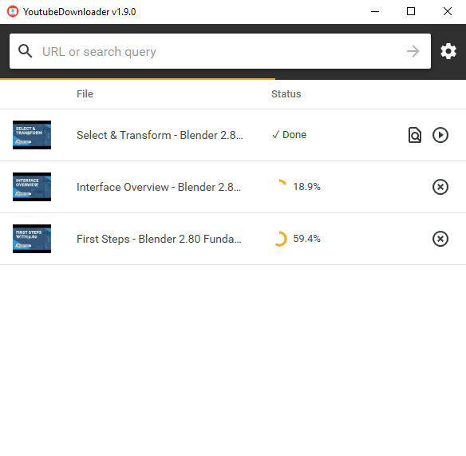
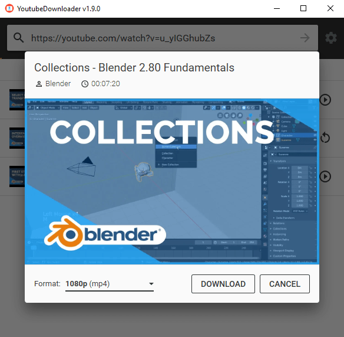
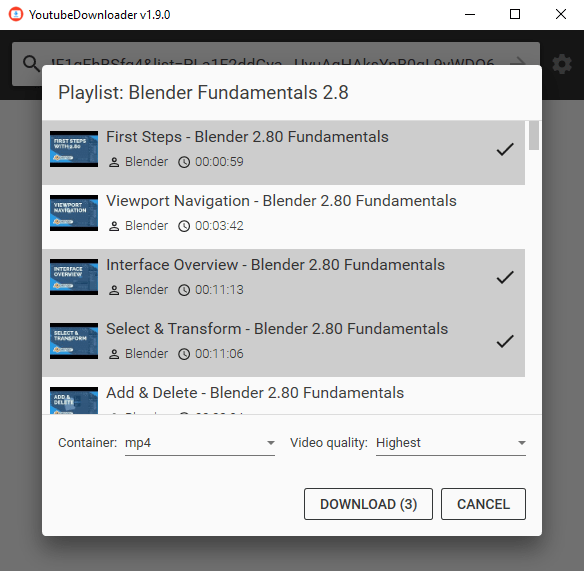

# YoutubeDownloaderRussian

> 🟡 **Статус проекта**: без понятия

**YoutubeDownloader** - это приложение, которое позволяет загружать видео с YouTube.
Вы можете скопировать и вставить URL любого видео, списка воспроизведения или канала и загрузить его непосредственно в формат по вашему выбору.
Он также поддерживает поиск по ключевым словам, что полезно, если вы хотите быстро просмотреть и загрузить видео.

Это приложение использует [**YoutubeExplode**](https://github.com/Tyrrrz/YoutubeExplode) под капотом для взаимодействия с YouTube.

## Условия использования

Используя это вы не должны ничего подписывать, кому то доказывать что вы против какой то из политических сторон и т.д. Зачем делать такой мусор??

## Скачать

- 🟢 **[Стабильный выпуск](https://github.com/HYBAS22/YoutubeDownloaderRussian/releases/latest)**

## Фичи

- Скачать видео по URL
- Загружайте видео из списков воспроизведения или каналов
- Загрузка видео по поисковому запросу
- Выбираемое качество и формат видео
- Автоматическое встраивание субтитров
- Автоматическое введение тегов мультимедиа

## Скриншоты

